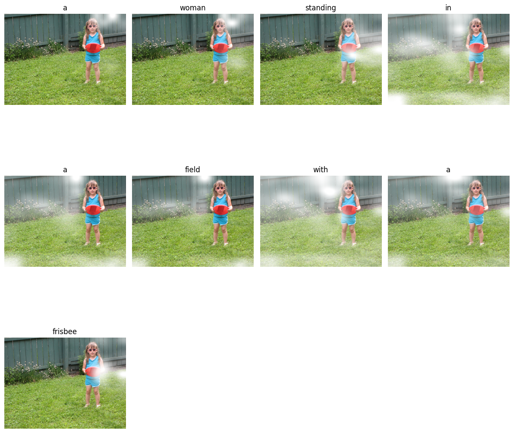

# 🧠 RNN-Based Image Captioning with Attention

This project implements an image captioning pipeline using Recurrent Neural Networks (RNNs) and the Bahdanau attention mechanism. It is trained and evaluated on the MS COCO dataset (Karpathy splits). The model generates natural language descriptions of input images based on visual features extracted from a pretrained CNN.The model architecture is inspired from the 2015 paper "Show, Attend and Tell"

## [**DEMO**](https://huggingface.co/spaces/harrykesh/Captioning_Demo)

---

## 📦 Features

- 🔍 **CNN + RNN architecture** for end-to-end image captioning  
- 🧠 **Bahdanau attention mechanism** for dynamic feature focus  
- 🗂️ Uses **precomputed image features** (ResNet/VGG) for efficiency  
- 🧪 Includes **early stopping**, **BLEU score evaluation**, and overfitting on a small subset  
- 📊 Supports both **training** and **inference** modes

---

## 🛠️ Project Structure

```bash
.
├── data/                 # Python scripts to preprocess and use the MS COCO data.
├── model/                # Trained models(.pt) along with model source code and metric calculating script  
├── model_checkpoints/    # final model checkpoints with every architecture detail
├── notebooks/            # Jupyter notebooks I used to train,test and experimented with the model
├── coco/                 # COCO annotation jsons, test-images and data sample used along with the vocabulary
├── requirements.txt
└── README.md
````

---

## 📚 Dataset

* **MS COCO 2014** (Karpathy split)
* Preprocessed and tokenized captions
* Extracted CNN features using VGG(later on with Resnet50):

  * Shape: `(batch_size, 196,512)` from last convolutional layer

---

## 🚀 Setup Instructions

### 1. Clone the repository

```bash
git clone https://github.com/HibernatingBunny067/RNN-Captioning.git
cd RNN-Captioning
```

### 2. Set up the environment

```bash
pip install -r requirements.txt
```

### 3. Prepare data

Precompute CNN features using 'batched_pre_compute' from "loaders.py" or download pre-extracted features.

---

## 🧠 Model Overview

### Encoder

* CNN backbone (ResNet/VGG)
* Outputs visual feature maps

### Decoder

* RNN (LSTM)
* Bahdanau attention module
* Generates captions word by word

---

## 📈 Evaluation

* Caption quality is evaluated using **BLEU-1 to BLEU-4** scores
* Overfitting on a small subset (`500–1000` samples) is supported for debugging

---

## 🧪 Sample Results




---

## 💾 Saving & Loading

Models are saved in `model/` and `model_checkpoints/`:

* `best_trained_model.pt`
* `over_fit_model.pt`
* etc.

---

## ⚠️ GitHub Note

This repo uses **Git LFS** to handle large files (models, dataset annotations).

To clone properly:

```bash
git lfs install
git clone https://github.com/HibernatingBunny067/RNN-Captioning.git
```

---

## 📌 To-Do

* [ ] Add support for beam search decoding
* [ ] Add transformer-based captioning baseline
* [ ] Streamlined demo notebook

---

## 👨‍🔬 Author

Harikesh @ IIT ISM
Feel free to raise issues or submit pull requests!

---
